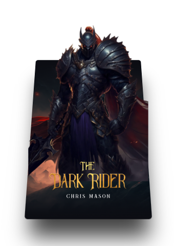
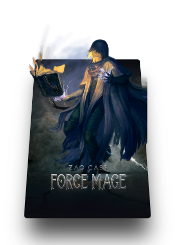

# 🎨 3D Card Hover Effect  

## 🚀 Overview  
This project showcases a **3D interactive card hover effect** using **HTML, CSS, and JavaScript**. When you move your cursor over the card, the avatar smoothly hovers above it, creating a cool **depth illusion effect**.  

## ✨ Features  
- **3D hover animation** on mouse movement  
- **Avatar lift effect** for an interactive experience  
- **Smooth transitions & perspective depth**  
- Fully responsive and easy to customize  

## 🛠️ Tech Stack  
- **HTML** 🏷️  
- **CSS (including animations & transforms)** 🎨  
- **JavaScript (event listeners for interactivity)** ⚡  

## 📂 Project Structure  
```
📦 3D-Card-Hover  
 ├📌 index.html  
 ├📄 style.css  
 └📄 script.js  
```

## ▶️ How to Run  
1. Clone this repository:  
   ```bash
   git clone https://github.com/yashpatil-1/3D-Card-Hover.git
   cd 3D-Card-Hover
   ```
2. Open the `index.html` file in your browser.  
3. Move your mouse over the card and enjoy the **3D hover effect!**  

## 📸 Preview  


  

## 🤝 Contributing  
If you have suggestions for improvements, feel free to fork this repository and create a pull request.  

## 📞 Contact  
For any inquiries, reach out via **[workwithme.3215@gmail.com](mailto:workwithme.3215@gmail.com)** or visit my **[GitHub Profile](https://github.com/yashpatil-1)**.  

---

